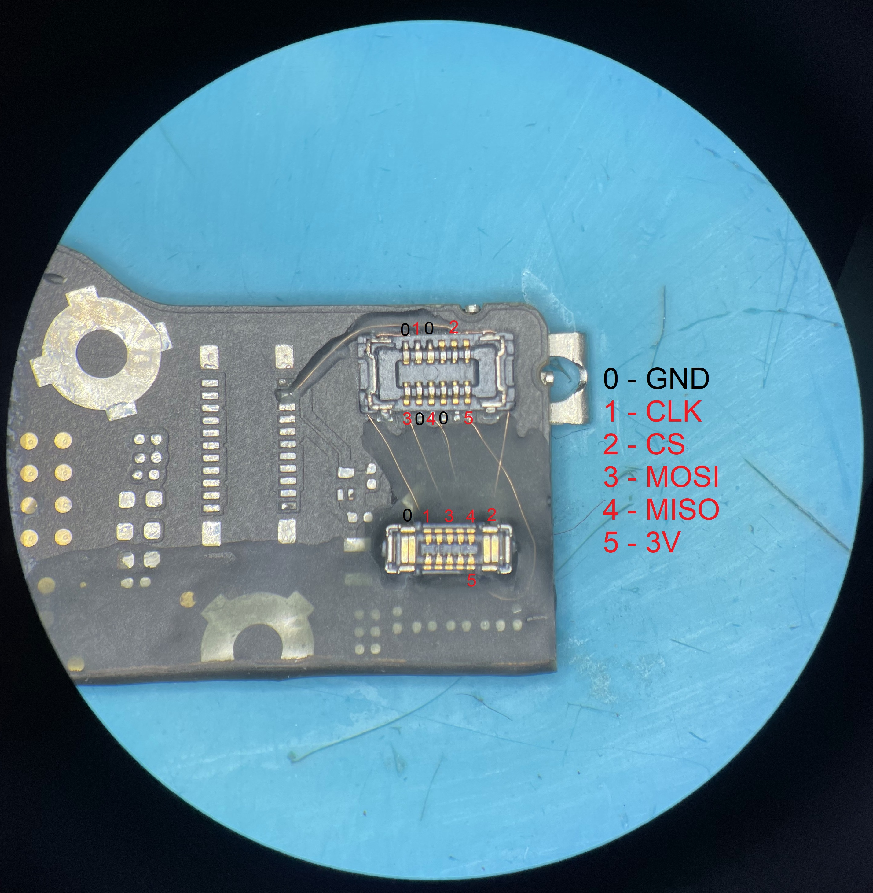
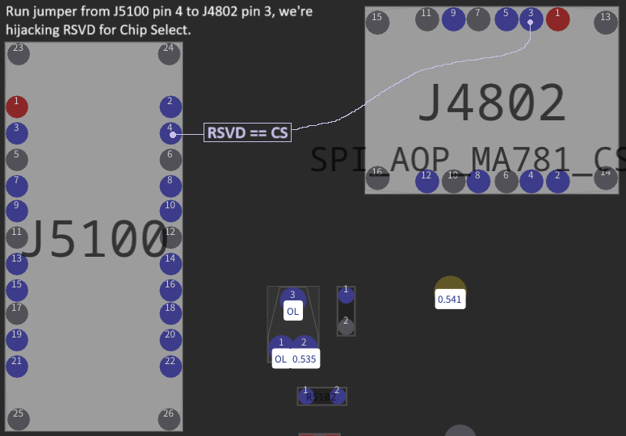
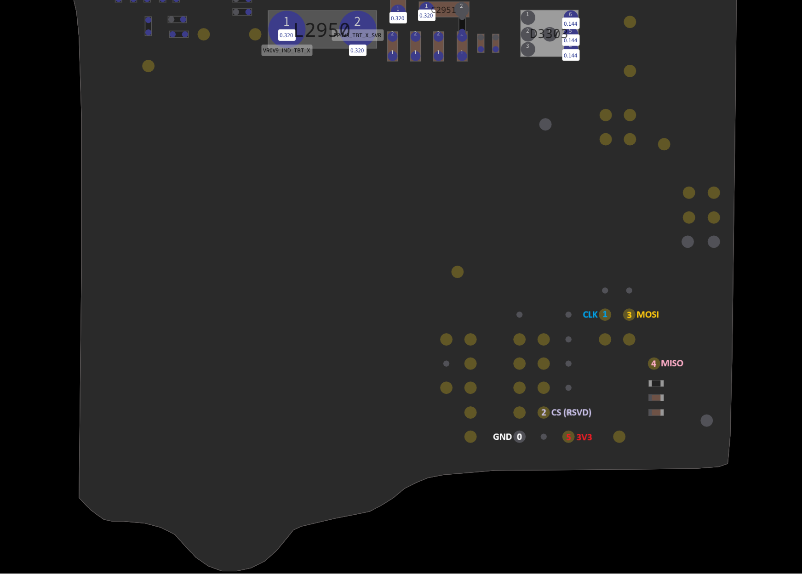
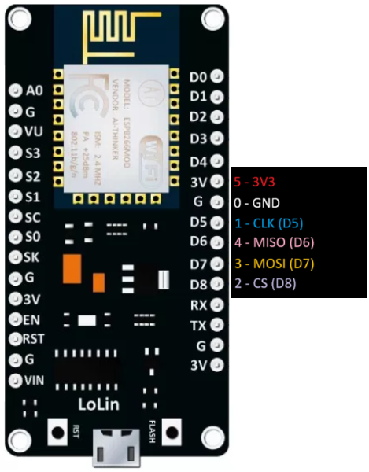

# MacBook Lid Angle Sensor Calibration Tool

This project builds on [Vladislav's work](https://github.com/Vladislav98759/Macbook-Lid-Angle-Sensor-Calibration-Tool).

It allows calibration of the lid angle sensor found in newer MacBook models:

- **Pro series**: A2141, A2442, A2485, A2779, A2780  
- **Air series**: A2681  

> ⚠️ **Note:** This project is a work in progress. Raspberry Pi Pico support is coming soon. Some information may currently be inaccurate while stuff is tested and improved.

## 🔧 Operating Modes

The programmer has **three operating modes**, selected by **short button presses**. The current mode is indicated by the number of LED blinks (1, 2, or 3).
To **activate** a mode, press and hold the button for **1 second**.

### Mode 1 – Pro Series Calibration
Calibrates Pro MacBooks (A2141, A2442, A2485, A2779, A2780).\
If calibration is successful, the LED stays lit for 3 seconds.

### Mode 2 – Air Series Calibration
Calibrates MacBook Air (A2681).\
If calibration is successful, the LED stays lit for 3 seconds.

### Mode 3 – Angle Detection
Activates real-time angle detection:
- **Lid open** → LED **on**
- **Lid closed** → LED **off**

#### Flashing Checks (Modes 1 & 2)
Before recording calibration data:
- **No sensor detected** → LED blinks **3 times**
- **Sensor from another (Apple-calibrated) device** → LED blinks **6 times**

## 🎥 Demonstration
Watch the device in action, credits to Vlad.

## 🧰 Required for Assembly

### Hardware
- **NodeMCU v1-3 (ESP8266)**
- **Raspberry Pi Pico (RP2040)**
- A connector board (e.g., cut-off piece of a MacBook A2141 motherboard)
  - A sub-board design for Pi Pico to attach is planned and will be added here
- **Connectors:**
  - `503548-1220 Molex` – for Pro models
  - `BM28P0.6-10DS-0.35V Hirose` – for Air models (also used in iPhone 11 as J_SIM_K)

### Software
- **Arduino IDE**
- Board support packages:
  - ESP8266 support
  - RP2040 (Raspberry Pi Pico) support
> (TODO: Add links)

## 🔌 Wiring & Connections

1. Connect the A2141 cut-off board using the Air connector as shown (or as needed).
   

2. Hijack the **J5100 RSVD** pin to use for **CS (Chip Select)**.
   

3. Connect your hardware to the test points.
   

- ESP8266 pinout reference\

- RP2040 pinout reference
> TODO: Add RP2040 pinout reference

5. Flash the firmware using the Arduino IDE.
> TODO: Add sketch programming instructions